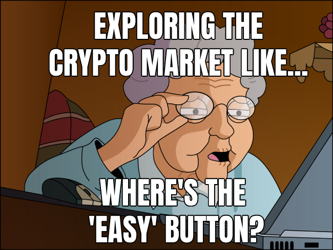

# Twi Social Network 🚀

Welcome to the Twi Social Network, the meme-tastic, crypto-charged, censorship-resistant social platform that's all about freedom, fun, and the mighty power of Web3!

## [Demo](https://twi.dappykit.org/). Linea Goerly only.

## What's the Twi Difference? 🎯

Twi isn't your grandma's social network. It's a fully-fledged, decentralized playground where:

- You can log in with memes and Metamask. Yes, you read that right. We think email-password pairs are so 2000-late. We're all about the memes! 🐸
- Building social connections doesn't cost a penny, or even an Ether. Got 0 ETH on your balance? No worries, we've got you covered with gasless transactions. No pay-to-play here!
- Your content lives on a decentralized file system. Why? Because you should be the boss of your own data, that's why. No centralized servers or sneaky third parties getting their mitts on your stuff.

## Your Network, Your Rules 👑

What's more? At Twi, we understand that your social connections are priceless. That's why we've baked them right into the smart contract. No more worrying about losing your followers if your account gets blocked for some mysterious reason. Your subs are yours, forever, enshrined in the immutable ledger of the blockchain. Pretty neat, huh?

## Under the Hood 🧰

Twi is powered by a spectacular trio of decentralized technologies:

### [Mutable File System on Immutable Storages](https://github.com/FairJournal/file-system) 💽

We're running a mutable file system that plays nicely with a bunch of decentralized storage systems. From IPFS and TON Storage to Torrent, Arweave, and Swarm, we're all about giving you freedom and control. Each update to the file system is signed cryptographically and can be verified by the whole community. Plus, you can manage your data through public gateways without needing your own storage node.

### [Meme Ethereum Wallet](https://github.com/DappyKit/meme-wallet) 🖼️

Because we can't get enough of memes, we're also using the Meme Wallet library. This nifty tool stores encrypted Ethereum wallets inside images using steganography. It's a fun, experimental way to secure wallets with user passwords.

### [Mutable File System Gateway](https://github.com/FairJournal/backend) 🌐

Twi also uses a decentralized file system gateway. This gateway provides a public, uncensored file system that's accessible via the web for data sharing. It interfaces with multiple decentralized storage platforms, providing key services to manage data securely and effectively.

### [Social Connections](https://github.com/DappyKit/demo-contracts): The Friend-Making Revolution (Without Gas Fees!) 🎉

`SocialConnections.sol`, a smart contract that's all about letting you manage your social connections in a decentralized way. But that's not the best part. We've got Ethereum's EVM in one hand and the OpenGSN package in the other, making gasless transactions a reality. Yep, no more worrying about the price of gas when following your bestie! 🚗💨

## Try it Out! 👩‍💻

Now, let's get one thing straight. Twi is a demo of a social network, not a real one. It's built on top of users' data that's uploaded to the public file system. But don't let that stop you! Give it a go, have a play, and see the future of social media in action.

So, ready to dive in? Follow our handy installation guide, set everything up, and you're good to go. Welcome to Twi, where the Web3 revolution is just a meme away!

## Grab the Wallet, Get the Prize! 🎁

Check out the attached Meme Wallet image at the top of the page. Looks cool, right? But what if we told you it's not just an image? Inside this picture is an Ethereum wallet with 10 shiny dollars sitting in it, waiting for a new owner. And that owner could be you! If you're the first one to decrypt the wallet using our tech, those funds are all yours to keep.

Oh, and did we mention it's on one of the EVM blockchains? Guess which one! Here's a little hint: it's not Ethereum. 😉

You can check out the wallet's balance right here: 0xeaD5A060A22aD612E8fda89F836A37D223e2ee3f. Password for the wallet is 111111.

So what are you waiting for? Get your code cracking and claim your prize! After all, who doesn't like a little crypto treasure hunt? 🕵️‍♀️💰